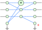
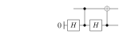

class: middle, title-slide, hide-count

## Hybrid quantum-classical circuit optimization with the ZX-calculus

.author[.underline[Agustín Borgna]¹², Simon Perdrix¹, Benoît Valiron³]

.date[23rd September 2020]

.affiliations[
¹ CNRS LORIA, Inria-MOCQUA, Université de Lorraine

² CNRS, LRI, Université Paris-Saclay

³ École CentraleSupélec, LRI, Université Paris-Saclay
]

???

Thank you,

Today I'll be presenting the work we did with Simon Perdrix and Benoît Valiron
on optimizing hybrid quantum-classical circuits.

So let's get to it.

----

---

# The setting

.padded[
- Mixed quantum-classical circuits expressed in the circuit model
]

.center[
  
]

???
**[Setting]** Our setting is the usual one for mixed quantum circuits where we have single qubit
unitary gates, CNOTs and controled Z gates.

**[Classical gates]** We also have classically controled single-qubit operations, measurement, qubit
preparation from either a constant or from a bit, and a reduced set of classical
gates consisting on NOTs and XORs.

**[Superdense]** Here we have a circuit representation of the superdense coding protocol.
Our goal is to describe an optimization algorithm that can rewrite this circuit
to an identity.

**[Circ patterns]** The usual way of optimizing quantum circuits is to find patters of quantum gates
than can be rewriten into smaller pattern.
The problem with that strategy is that there is no complete set of rewrite rules, so we
can always find bigger and bigger patterns to optimize.

----
- Our setting: Describing qCirc with usual set of gates

- NOT and XOR gates. No ANDs. (Is there a name for the fragment?)

- The circuit here **superdense coding protocol**.

- Goal: Optimize to identity

- The usual way of optimizing is patters

---
layout: true

# ZX-diagrams

.middle.center.font120[
  
  \\(\; \Rightarrow\\)
  {{content}}
]

???

We can sidestep that problem by using a more granular representation of the
circuit based on the ZX calculus.

**[ZX]** The ZX calculus is a formal graphical language that can represent any pure
quantum circuit.

**[Spiders]** The diagrams are composed by two kinds of nodes collored either green or red,
we call the Z-spiders and X spiders. They are also labeled with a phase.

**[HadamardW]** There is additionally a yellow constructor that represents a hadamard operation,
but for simplicity in our graph we will replace that generator with a special
kind of edge we call Hadamard wire.

**[Identities]**
Here the degree 2 spiders are just identities.

**[Rewrite]** The calculus comes with a complete set of rewrite rules,
between them is the spider fusion rule that lets us merge two spiders of the
same color connected by a regular edge.

**[Color]** There is also another rule that lets us change the color of a spider
by changing adding Hadamard wires to its connections.

**[Just Green]** Although this may add some extra complexity to the diagram,
it lets us work with a single color of spider, simplifying our definitions later.

**[Topology]** Another point to note is that diagrams can be freely deformed.
We only care about the topology, so the nodes can be freely moved around without
changing the interpretation of the graph.

----

- Formal Graphical Language
- Complete set of rewriting rules
- Only topology matters, deformation

---

---
count: false

---
count: false

---
count: false

---
count: false

---
count: false

???

---
layout: false

# Pure ZX optimization

.padded[
- Clifford optimization for pure circuits
(Duncan et. al. arXiv:1902.03178)
]

.center.font80[
  
  \\(\; \xrightarrow{Translate}\\)
  

  

  \\(\; \xrightarrow{Optimize}\\)
  
  \\(\; \xrightarrow{Extract}\\)
  
]

???

**[Previous work]** Using the ZX calculus, Simon Perdrix with
**Duncan**, **Kissinger**, and **van de Wetering**
introduced an "clifford optimization" procedure for pure circuits.

**[Steps]**
The procedure starts with a pure quantum circuit,
then it does a translation into a ZX diagram in a special "graph-like" form,
then it optimizes it using some specially crafted rules in a terminating algorithm,
and finally it extracts the diagram back into a smaller circuit.

**[Our modifications]**
We will modify each of the steps in this procedure to be able to optimize mixed circuits.

----

---
layout: true

# The \\(\zxGnd\\)-calculus

.padded[
  - \\(\zxGnd\\) adds a discarding *ground generator*
]

.center.padded[
  {{content}}
]

.center.font80[
  
  \\(\qquad=\qquad\\)
  
  
  
  \\(\qquad=\qquad\\)
  
]

???

**[Only pure]** Since the ZX calculus can only represent pure quantum
operations,
we use an extension called ZX ground which adds an additional information-discarding generator.

**[ground Spiders]** Since the ground generator is commonly connected to a single spider, we call
these constructions "grounded spiders".

**[rules]** ZX ground defines some extra rewrite rules, more notably the discarding rule 
that removes spiders connected to ground,
and the connection rule that lets us disconnect Hadamard wires between grounded spiders.

---

---
count: false

---
layout: true

# Quantum circuits as \\(\zxGnd\\)-diagrams

.center.font110[
  
  \\(\; \mapsto \\)
  {{content}}
]

.padded[
  - The translated diagram is *weakly graph-like*
]

???

**[translation]** Now using the ZX ground calculus we define **our** translation
from mixed circuits to into diagrams,
using a different method than the one defined in the Clifford Optimization.

**[IO labels]**
Here we have to keep track on which of the inputs and outputs were quantum wires,
and which where classical.

**[graph-like]** We produce diagrams in a special form called weakly graph-like,
were we only have green spiders and internal Hadamard wires.

**[strict]** We then transform these weakly graph-like diagrams
into a strict version that does not allow multiple inputs, outputs, or grounds
connected to the same spider.
This lets us detach the grounded spiders from the inputs and outputs.

----

- *Superdense coding protocol*

---

---
count: false

---
count: false
layout: false

# Quantum circuits as \\(\zxGnd\\)-diagrams

.center.font110[
  
  \\(\; \mapsto \\)
  {{content}}
  
  
]

.padded[
  - The translated diagram is *~~weakly~~* **strictly** *graph-like*
]

???

**[strict]** We then transform these weakly graph-like diagrams
into a strict version that does not allow multiple inputs, outputs, or grounds
connected to the same spider.
This lets us detach the grounded spiders from the inputs and outputs.

----

---
layout: true

# Underlying open-graph

.center.font110[
  
  \\(\; \mapsto \;\\)
  {{content}}
]

.padded[
- Labeled .blue[input] and .red[output] nodes

- Admits a *focused gFlow*
]

???

**[open-graph]** When we have a strictly graph-like diagram we can talk about
its underlying structure in the form of an open-graph; a simple graph with sets
of input and output nodes.

**[ground outputs]** We mark the ground spiders as outputs because they represent the discarding
of information into the environment.

**[lost wires]**
When we translated the circuit into a diagram we lost the idea of quantum and
classical wires since here we can deform the graph freely.

**[gFlow]**
But we can define a property on the underlying open-graph called focused gFlow
that will give us some notion of order on the spiders
which will be necessary when we extract the diagram back into
a circuit.

**[Preserve gFlow]** It is important that we preserve the gFlow property,
so we must restrict the rewriting rules we use when optimizing.

----

- Set of *Input*, *Output* nodes
- Grounded spiders discard info
- Admits a *focused gFlow*
  - A notion imported from MBQC.
  - (Guarantees uniformly stepwise strong determinism)

---

???

---
layout:false

# ZX diagram optimization rules

.padded[
- Clifford optimization rules
(Duncan et. al. arXiv:1902.03178):
]

.center[
Local complementation:  

Pivot:  
]

???

On the algorithm by Duncan et al. they introduced two gFlow preserving rules
that eliminate spiders with a phase multiple of PI/2, called Clifford spiders.

**[!-boxes]** The boxes in these diagrams represent any number of neighbour spiders.

**[algorithm]** They defined their optimization algorithm by repeatedly applying
these rules until reaching a stable diagram.
Since both rules delete at least one spider,
the algorithm terminates on some local minima.

**[We adapted]** We adapted these rules to the ZX ground calculus and in
addition introduced a number of new rules ones.

----

- On a similar formulation of graph-like diagrams in the base ZX
  - Ross Duncan, Alex Kissinger, Simon Perdrix, John van de Wetering

- Base optimizations:
  - Pivot paulis
  - Local complementation of Cliffords

- Bang-boxes
  - Already-connected spiders get disconnected

- Loop until finished

---

# Ground-related optimizations

.center[

Discarding: 

\\(\ =\ \\)

Ground-Pauli pivot: 

\\(\ =\ \\)

]

???

**[rules]** The first rule is the discarding rule,
which lets us delete spiders connected to a grounded spiders of degree one,

and the Ground-Pauli pivot rule deletes spiders with a phase of 0 or PI
connected to a grounded spider.

**[use same algorithm]**
We could repeat the strategy of the Clifford
optimization algorithm,
applying these rules until we cannot find any matches.

But there is a way to look for extra optimization opportunities
by looking at the ground-cut of the graph.

----

---
layout: true

# Finding optimizations on the ground-cut diagram

.hpadded[
- Find optimization opportunities by looking at the ground-cut biadjacency
  matrix
]

.center[
  {{content}}
]

.hpadded[
- Apply Gauss elimination on the matrix
]

.center[

\\(\ =\ \\)

]

???

**[partition]** The ground-cut is a partition between the grounded spiders and
non-grounded spiders.

**[matrix]**
The biadjacency matrix of this ground-cut is a binary matrix that encodes the
conectivity between the partitions.

**[row-sum]**
We define a new gFlow preserving rule that will let us apply row sums operations
over this biadjacency matrix by modifying the graph.
Therefore we are able to apply Gauss Elimination on the matrix.

**[all zeroes]**
What we end up with is a matrix that may have some rows at the bottom
were all elements are zero, that means that there is some ground spider of
degree zero which we can delete.

**[single non-zero]**
There may also be rows with only one non-zero element.
That corresponds to grounded spiders of degree 1,
where we can apply the discarding rule.

**[new matches]**
So after running Gauss elimination on the cut we may create new rule matches to
eliminate spiders from the diagram.

----

- Ground cut: **Partition** of the vertices
- Mtx encodes connectivity between sets
- Gauss elimination

---

\\(\ \mapsto\ 
  \begin{pmatrix}
    1 & 1 \\\\
    0 & 1 \\\\
    0 & 1 \\\\
  \end{pmatrix}
\\)

---
count: false

\\(\ \mapsto\ 
  \begin{pmatrix}
    1 & 0 \\\\
    0 & 1 \\\\
    0 & 1 \\\\
  \end{pmatrix}
\\)

---
count: false

\\(\ \mapsto\ 
  \begin{pmatrix}
    1 & 0 \\\\
    0 & 1 \\\\
    0 & 0 \\\\
  \end{pmatrix}
\\)

---
layout: true

# Optimization algorithm

.columns.padded[

.column50[
Simplified algorithm:
1. Run Clifford optimizations  

2. Repeat until stable:

  1. Gauss elimination on ground-cut 

  2. Remove disconnected grounds

  3. Apply discard rule

  4. Apply ground-Pauli pivots
]

.column50.center[

{{content}}
]

]

???

**[clifford]**
We can then define the optimization algorithm by first running the original
Clifford optimization

**[gauss, disconnected]**
then we run Gauss elimination on the ground-cut,
and look if there are grounded spiders with degree 0 to delete.

**[degree 1]**
Then we apply the discard rule on ground spiders of degree 1.

**[pauli]**
And finally we apply ground-Pauli pivots where possible.

**[repeat]**
After this we repeat the this last part until we cannot find more rule matches.

**[termination]**
Since all rules remove at least one spider, this procedure terminates.

**[now to extract]**
At the of the algorithm, we obtain a smaller diagram which admits a gFlow,
but we still have to define some extraction operation to get back a circuit.

----

- Loop until no nodes to eliminate
- Terminates in polinomial time

- Complexity analysis: Loose bound - qubic on spiders

---

---
count: false

---
count: false

---
count: false

---
layout: true

# Circuit extraction

.padded[
- Based on Duncan et al.'s procedure

- Introduces fan-in and fan-out extractions
]

.center[
  {{content}}
]

???

**[Expand Duncan et al]**
We modify the extraction algorithm from the Clifford optimization.

**[Border, sweep]**
We use the same strategy, where we define a **border** set of spiders
starting from the outputs and then sweep left, one spider at a time.

**[contribution]**
Our contribution comes with two special cases that were not present in pure
reversible circuits.

**[fan-out]**
In the first case, which we call fan-out, an unextracted spider is connected to
multiple border spiders.
We can translate this as initializing a new line and applying some Hadamards and
controlled Zs.

**[fan-in]**
The other special case is the fan-in,
where we have multiple unextracted spiders connected to a single border spider.

**[mostly ground neighbours]**
Since the diagram admits a gFlow, we know that at least n-1 of the unextracted
spiders must be grounded spiders.
We can then extract them as measuring the line and discarding the result.

**[Classical inputs]**
At the end of the extraction algorithm,
if there are any classical wires as inputs,
we use them to inizialize new qubits wires.

**[Color change]**
Afterwards we can apply the color changing rule to eliminate some Hadamards and
simplify the circuit one last time.

**[Quantum internals]**
At this point we have extracted a valid circuit, but you may note that all the
internal operations are pure quantum.

**[Example wastefull]**
For example this part here is creating a new qubit to use as control in a CNOT
and measuring it rigth after.

----

---

---
count: false

---
count: false

---
count: false

---
count: false

---
count: false

---
count: false

---
count: false

---
count: false

---
count: false

---
count: false

---
count: false

---
count: false

---
layout: false

# Detecting classical wires

.padded[
- Label the spiders that can form a classical gate

- Use classical logic where possible
]

.center[

]

???

**[Find classical parts]**
We introduced an algorithm for classicalization of mixed circuts,
which puts labels on the spiders in the diagram
to detect parts of the circuit that can be realized classically.

**[Good result]**
In this case we detect that we can do a classically controlled operation.

**[The end]**
And with this we have reached the final circuit.

----

- Classical in the Computational or in the Hadamard basis

- Expansion rules have to contemplate **color**, **label**, and **type of edges**
  for each spider.

  - Show just examples, not the full rules

---
class: inverse, noheader

.padded[

.bold[Summary:]

- Extended a pure-quantum optimization algorithm to mixed circuits using \\(\\zxGnd\\)

- Introduced new optimization rules using the discarding operator

- Defined an extraction procedure for the optimized diagrams

- Implemented and tested on the *pyzx* python library
]

???

In this talk I described an optimization procedure
for mixed quantum-classical circuits using the formal ZX ground calculus.

We introduced a number of gFlow-preserving rewriting rules,
and extended an extraction algorithm from these diagrams.

This included a classicalization procedure to detect
parts of a mixed circuit that can be done classically.

**[pyzx]**
We have implemented the algorithms on the pyzx python library,

and now we plan to benchmark it's performance on real-world circuits with mixed
quantum and classical logic.

----

--

.center.bold[
  Thanks!
]