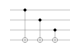
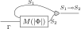
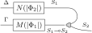

class: middle, title-slide, hide-count

## Encoding High-Level Quantum Programs as SZX-Diagrams

.author[.underline[Agustín Borgna]¹², Rafael Romero³]

.date[25th March 2022]

.affiliations[
¹ CNRS LORIA, Inria-MOCQUA, Université de Lorraine

² CNRS, LMF, Université Paris-Saclay

³ CONICET, Instituto de Ciencias de la Computación, Universidad de Buenos Aires
]

???

**[Intro]**

- Work with Rafael Romero.
- Compiling high-level quantum programs into an
  intermediate representation that can be used for optimization.
- Won't talk much about quantum computing,
  just describe it from an operational level.

---

# Quantum programs and circuits

.padded[
- Proto-Quipper-D is a language for describing quantum programs

  ```haskell
  bell00 : ! (Unit -> Qubit * Qubit)
  bell00 u = 
      let x = Init0 ()
          y = Init0 ()
          x' = H x
      in CNot y x'
  ```

- Compiled down to circuits of gates
  .center[
  
  ]

]

???
**[Quipper]**

- Chosen as starting language Proto-Quipper-D.
- Version of the well-known Proto-Quipper language
  with linear dependant types
- By Peter Selinger, with Francisco Rios and many other people
- Interpreter implemented by Peng Fu

**[Use]**

- We describe quantum computations
  as maps between lists of "qubit" elements by composing primitive operations. 
- Here, for example, we have a description of a program
  (in a Haskell-like syntax)
  that takes no input and produces a pair of qubits in a
  special state (called a Bell state).
- For this, the program initializes two new qubits,
  and then applies a series of predefined "quantum gates" to them.
- Important: Qubits are linear resources, this must type check.

**[Circuits]**

- To be able to run on an actual quantum computer,
  the quantum operations are commonly compiled to quantum circuits,
  represented similarly to digital electronic circuits.
- Qubits as wires, predefined set of gates.
- Initialization, Hadamard, CNOT, etc.

**[Cue generics]**
- What if instead of a pair we had a list of qubits?

---

# Dependent types for generic programming

.padded[

- Supports dependent types

  ```haskell
  accumap : ! forall a b c (n : Nat)
            -> Vec (a -> c -> b * c) n -> c -> Vec a n -> Vec b n * c

  cnotN : ! forall (n : Nat) -> Vec Qubit n * Qubit -> Vec Qubit n * Qubit
  cnotN (ctrls, q) = accumap (λ c q -> flip $ CNot q c) q ctrls
  ```

- Compilation requires instantiation (e.g. `n = 3`)
  .center[
  
  ]

]

???
**[Dependent types]**

- Proto-Quipper-D supports dependent types.
- This means that we can have types that depends on values.
- For example, we can have a function that operates with vectors of qubits
  with a parametric size.

**[CNOTs]**
- Here we have a function that takes a list of n "control" qubits and a target,
  and applies the two-qubit CNOT operation once per element of the list.

**[Instantiation]**
- If we want to show this as a circuit,
  we must first instantiate the n parameter to a concrete value.
- Here we see that for `n=3` we produce the desired circuit,
  with list and extra qubit as inputs and the application of a 
  CNOT operation using each element of the list.

---

# Quipper-D calculus

.padded[
- Specification à la lambda

  .font80.center[
  \\(
    \begin{aligned}
    \text{bell00} &: \text{Unit} \multimap \qubit * \qubit \\\\
    \text{bell00} &:=
    \lambda u^{\text{Unit}}. \mathsf{CNot}\ (\mathsf{Init0}\ \star)\ (\mathsf{H} (\mathsf{Init0}\ \star))
    \end{aligned}
  \\)
  ]

- We use a simplified fragment with bounded programs (no explicit recursion)

- Types split between linear states and parameters

  .center.font80[
  Types \\(A := S \;|\; P \;|\; (n : P) \to A[n]\\)

  States \\(S := \text{Qubit} \;|\; S_1 \multimap S_2 \;|\; \text{Unit} \;|\; S_1 \otimes S_2 \;|\;  \text{Vec } S\ (n: \nat) \\)

  Parameters \\(P := \nat\\)
  ]

]

???

**[Lambda]**

- Quipper programs can be represented as lambda terms.
- (Example: the bell00 program from before)
- We took a simplified fragment of it with only the relevant operations,
  and disallowing explicit recursion due to our target language.

**[Terms]**
- The simplified types are divided between states
  (lists and tuples of qubits) and parameters (numbers).
- Only Nats as parameters
- A quantum circuit is a map between states, and any parameter needs to have been instantiated before.
- States must be used linearly, we want no discarding nor cloning.

---

# Calculus terms

.padded[

- Terms:

  .font80[
  \\[\begin{aligned}
    M, N, L :=\; & x \;|\; C \;|\; \lambda x^S. M\;|\; \lambda' x^{\nat}. M \;|\; M \; N \;|\; M;N \;|\; \\\\
    & U \;|\; \text{init0} \\\\
    & \star \;|\; M \otimes N \;|\; \text{let }{x^{S_1} \otimes y^{S_2} = M}\text{ in }{N} \;|\; \\\\
    & \text{VNil} \;|\; M : N \;|\; \text{let }{x^S : y^{\vec S n} = M}\text{ in }{N} \\\\
    & M \square N \;|\; \text{ifz }{L}\text{ then }{M}\text{ else }{N} \;|\; \\\\
    & \text{for }{k^\nat}\text{ in }{M}\text{ do }{N}
  \end{aligned}\\]

  with \\(\square\in\\{+, -, \times, / \\}\\)
  ]

- Extra list-manipulating primitives (C) to replace explicit recursion

  `accuMap`, `map`, `fold`, `split`, `concat`, `compose`, `range`, ...
]

???

**[Terms]**

- .TODO[Guided by syntaxis]
- Diferent lambda terms for states and parameters.
- Foreach term to instantiate a parameter with multiple values.

**[Primitives]**

- Non minimal set of primitives
- Suffices to have the accumulating map, `split`, and `concat`

**[Cue ZX]**

- As I said, we use Quipper as as a starting language for quantum circuits.
- It's time to talk about our target representation.

---

# The ZX calculus

.padded[
- Alternative representation of quantum circuits
  ![:vspace 1em]

  .center[
  
  →
  ![:hspace 1em]
  
  ![:hspace 6em]
  ]

  ![:vspace 1em]

- Only topology matters

- Formal rewrite system

- Useful for optimization, simulation, and more
]

???

**[ZX]**

- More granular representation of quantum circuits
- Undirected graphs with two-coloured nodes, and yellow generator
- Nodes may be tagged with a phase
- Can translate a quantum circuit directly (CNOT is now two nodes)
- Topology: It's a graph, so nodes and edges can be moved around
- Formally, it corresponds to a compact closed symmetric monoidal category
- Complete formal rewrite system lets us define formally proven optimization procedures

**[Limitations]**

- Edges carry the information of one qubit
- Still restricted to representing concret circuits

---

# SZX Diagrams

.padded[
- Introduces multi-qubit wires (in bold) and gatherer/splitter nodes
  .center[
  
  ]

- Can encode parallel and iterative operations
  .center[
  `CnotN` → 
  ]
]

???

**[SZX]**

- The Scalable extension of the ZX calculus (SZX) lifts this restriction,
  by allowing to represent quantum circuits with an arbitrary number qubit in a compact form
- Edges of the graph may carry the information of multiple qubits
- Tag wires in bold
- Introduces a gatherer/splitter node

**[Example]**

- Cnots takes a list of n qubits and a target
- Bold CNOT is n cnots in paralell
- Loops around, applying  target to each of them

---

# Lambda terms as SZX-diagrams

.padded[
- Translate type judgements to families of diagrams
  .font90.center[

  \\(\Gamma, \Phi \vdash M : S \quad \\)
  →
  \\(\quad |\Phi| \mapsto\\)
  
  ]

- State types translate to number of qubits

  .center.font90[
  \\(\trans{\mathsf{Qubit}} = 1\\)

  \\(\trans{\mathsf{Vec}\ A\ n} = \trans{A} \times n \\)

  \\(\trans{A \multimap B} = \trans{A \otimes B} = \trans{A} + \trans{B}\\)
  ]

- Parameters create generic diagrams
  .font90.center[

  \\(\Gamma, \Phi \vdash M : (n:\nat) \to S[n] \quad \\)
  →
  \\(\quad |\Phi|, n \mapsto\\)
  
  ]

]

???

**[Automatization]**

- From quipper, we have defined a translation into SZX
- Recursively on the derivation of the type judgements
- Separate state context and parameter context

**[Types]**

- Diagrams are compact closed, functions are equivalent to products

**[Notation]**

- I will ignore the translation brackets most of the time

---

# Some term translations

.padded[
- State operations are represented diagrammatically
![:vspace 2em]

.font80.center[

\\(
  \begin{prooftree}
    \AxiomC{$\Gamma, x:A,\Phi \vdash M:B$}
  \RightLabel{ $\multimap_i$}
  \UnaryInfC{$\Gamma, \Phi \vdash \lambda x^A . M : B$}
  \end{prooftree}
  \quad
\\)
→
\\(\quad |\Phi| \mapsto \\)


![:vspace 2em]

\\(
  \begin{prooftree}
    \AxiomC{$\Gamma,\Phi_1 \vdash M:A \multimap B$}
    \AxiomC{$\Delta,\Phi_2 \vdash N:A$}
  \RightLabel{ $\multimap_e$}
  \BinaryInfC{$\Gamma, \Delta, \Phi_1, \Phi_2 \vdash M\ N : B$}
  \end{prooftree}
  \quad
\\)
→
\\(\quad |\Phi_1|, |\Phi_2| \mapsto \\)


]
]

???

**[Lambda terms]**

- Lambda terms on states are translated as diagrams
- Diagrams are flexible, lambda is moving the variable to the context
- Application is connecting the appropriate wires

---

# Some more term translations

.padded[
- Parameter operations are interpreted at compilation-time
![:vspace 2em]

.font80.center[

\\(
  \begin{prooftree}
    \AxiomC{$\Gamma,\Phi,n:\nat \vdash M:B[n]$}
  \RightLabel{ $\to_i$}
  \UnaryInfC{$\Gamma, \Phi \vdash \lambda' n^\nat . M : (n: \nat) \to B[n]$}
  \end{prooftree}
  \quad
\\)
→
\\(\quad |\Phi|, n \mapsto \\)


![:vspace 2em]

\\(
  \begin{prooftree}
    \AxiomC{$\Gamma,\Phi_1 \vdash M:(n:\nat) \to B[n]$}
    \AxiomC{$\Phi_2 \vdash N:\nat$}
  \RightLabel{ $\to_e$}
  \BinaryInfC{$\Gamma, \Phi_1, \Phi_2 \vdash M\ N : B[N/n]$}
  \end{prooftree}
  \quad
\\)
→
\\(\quad |\Phi_1|, |\Phi_2| \mapsto \\)


]
]

???

**[Parameter lambda terms]**

- On the other hand, parameter lambdas and applications do not change the structure of the diagrams
- Applying an integer term requires interpreting it as a mathematical expresion

---

# Example: Quantum Fourier transform for N qubits

.hpadded[

- Encoded as a lambda term
  
  .font70[
  
  \\(
  \begin{aligned}
    \text{qft} &: (n:\nat) \to \vec{\ \qubit}{n}\multimap\vec{\qubit}{n} \\\\
    \text{qft} &:= \lambda' n^\nat.\lambda qs^{\vec{\qubit}{n}}.
        \Qcompose \\\\
        & (\Qfor{k}{\text{reverse\_vec } (0..n)}
        {\lambda qs'^{\vec{\qubit}{n}}.\text{apply\_crot } n\ k\ qs'})\ qs
  \end{aligned}
  \\)
  
  \\(
  \begin{aligned}
    \text{apply\_crot}&: (n:\nat) \to (k:\nat) \to \vec{\qubit}{n} \multimap \vec{\qubit}{n} \\\\
    \text{apply\_crot}&:= \lambda' n^\nat.\ \lambda' k^\nat.\ \lambda qs^{\vec{\qubit}{n}}.
    \ifz{n-k}{qs}{}\\\\
    & \Qlet{h^{\vec{\qubit}{k}}\otimes qs'^{\vec{\qubit}{n-k}}}
    {\Qsplit\ k\ (n-k)\ qs}{}\\\\
    & \Qlet{q^\qubit \otimes cs^{\vec{\qubit}{n-k-1}}}
    {\text{chop } qs'}{}\\\\
    & \Qlet{fs^{\vec{(\qubit\otimes\qubit\multimap\qubit\otimes\qubit)}{(n-k-1)}}}
    {\Qfor{m^\nat}{2..(n-k+1)}{\text{crot }m}}{}\\\\
    & \Qlet{cs'^{\vec{\qubit}{n-k-1}}\otimes q'} 
    {\Qaccumap\ fs\ (H\ q)\ cs}{}\\\\
    & \text{concat } h\ (q': cs')
  \end{aligned}
  \\)
  
  \\(
  \begin{aligned}
    \text{crot}&: n:\nat\to (\qubit\otimes\qubit)\multimap (\qubit\otimes\qubit)\\\\
    \text{crot}&:= \lambda' n^{\nat}.\lambda qs^{\qubit \otimes \qubit}.\ \Qlet{c^\qubit \otimes q^\qubit}{qs}{flip\ (R\ n\ q\ c)}
  \end{aligned}
  \\)
  
  ]

- Compiled quantum circuit contains \\(\\mathcal{O}(n^2)\\) gates

]

???

**[Example]**

- Let's finish with a concrete example of a complex algorithm
- The exists a quantum version of the Fourier Transform for lists of qubits
- (do not look to deeply into this definition)
- Here we have shown that it can be encode it in the fragment of Proto-Quipper-D
- Normally a compilation into a quantum circuit requires a cuadratic number of gates
- We can do a constant size encoding

- Let's go by parts

---

# Example: QFT translation (1)

.padded[

\\(
\begin{aligned}
  \text{crot}&: n:\nat\to (\qubit\otimes\qubit)\multimap (\qubit\otimes\qubit)\\\\
  \text{crot}&:= \lambda' n^{\nat}.\lambda qs^{\qubit \otimes \qubit}.\ \Qlet{c^\qubit \otimes q^\qubit}{qs}{flip\ (R\ n\ q\ c)}
\end{aligned}
\\)


.center[
  \\(n \mapsto \\)
  
]

]

???

**[C-Rot]**

- First, the crot term takes a pair of qubits a rotation gate over them
- This is parametrized with an int for the rotation angle
- We have a straightforward translation of this into SZX
- Splitting the pair, applying the rotation, and bundling them again

---

# Example: QFT translation (2)

.padded[

\\(
\begin{aligned}
  \text{apply\_crot}&: (n:\nat) \to (k:\nat) \to \vec{\qubit}{n} \multimap \vec{\qubit}{n} \\\\
\end{aligned}
\\)


.center[
  \\(n,k \mapsto \\)
  
]


.font70[*Omitting the ifz translation]

]

???

**[apply crot]**

- The apply_crot uses the previus term
- Does an operation similar to the CNOTs function we saw before on a portion of the list
- I don't show the check that n>k but it's just a bypass

---

# Example: QFT translation (3)

.padded[

\\(
\begin{aligned}
  \text{qft} &: (n:\nat) \to \vec{\ \qubit}{n}\multimap\vec{\qubit}{n} \\\\
  \text{qft} &:= \lambda' n^\nat.\lambda qs^{\vec{\qubit}{n}}.
      \Qcompose \\\\
      & (\Qfor{k}{\text{reverse\_vec } (0..n)}
      {\lambda qs'^{\vec{\qubit}{n}}.\text{apply\_crot } n\ k\ qs'})\ qs
\end{aligned}
\\)


.center[
  \\(n \mapsto \\)
  
]

]

???

**[qft]**

- Finally, qft applies the previous term n times, varying the value of k
- If we compose these translations, we obtain a compact diagram
  that represents the QFT operation over any arbitrary number of qubits
- No need for quadratic number of gates, we have a constant size encoding
- In general, linear for the size of the program and independent of the parameters

---
class: inverse, noheader
name: last

.padded[

.bold[Summary:]


- Defined a fragment of Proto-Quipper-D that encodes non-trivial algorithms


- Translated the fragment to SZX diagrams


- Produced diagram sizes depend only on the length of the program (linearly)


- Future work: Implement translation based on the *dpq* interpreter

]

???

----

--

.center.bold[
  Thanks!
]

---

# Extra: Translating the 'for' primitive


.padded.font80.center[


\\(
  \begin{prooftree}
    \AxiomC{$n:\nat$}
    \AxiomC{$\Phi\vdash V: \text{Vec } \nat\ n$}
    \AxiomC{$\Gamma, k:\nat\vdash M:A$}
  \RightLabel{ for}
  \TrinaryInfC{$\Phi, \Gamma^n \vdash \text{for } k\text{ in }V\text{ do }M : \text{Vec }A\ n$}
  \end{prooftree}
  \quad
\\)
→
\\(\quad |\Phi_1| \mapsto \\)


]

---

# Extra: Translating the 'accumap' primitive


.padded.font80.center[


\\(
  \vdash \mathtt{accuMap}:
  (n:\nat) \to \text{Vec } A\ n
  \multimap \text{Vec } (A \multimap C \multimap B \otimes C)\ n
  \multimap C \multimap \text{Vec } B\ n \otimes C
  \quad
\\)
→


\\(n \mapsto \\)


]