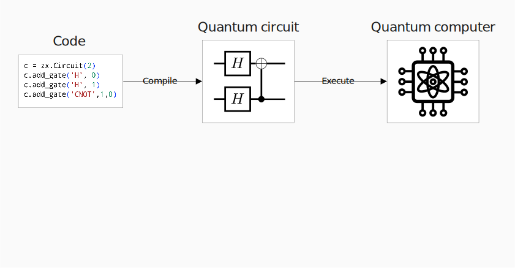
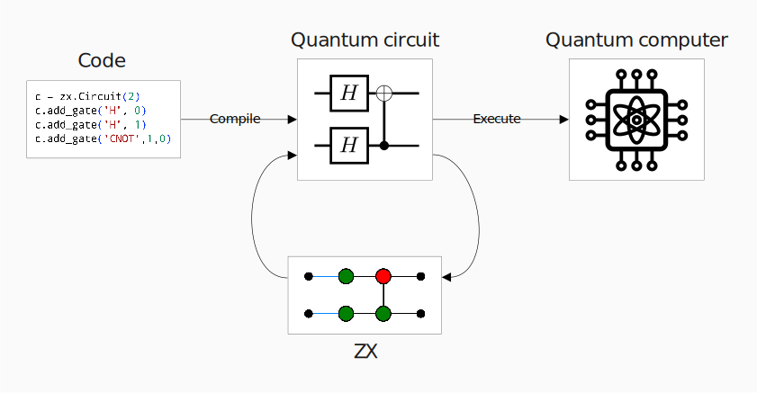
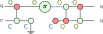
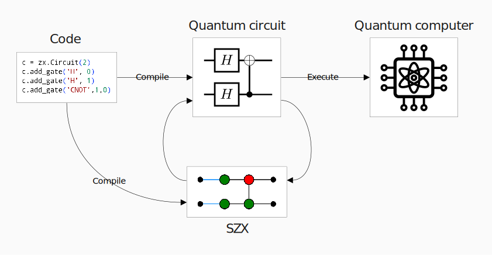

class: middle, title-slide, hide-count

## ZX diagrams as IR for quantum compilers

.author[Agustín Borgna]

.author[Advisors: Simon Perdrix, Benoît Valiron]

.date[9th June 2022]

---

# The lifecycle of quantum programs

.center[

]

---
count: false

# The lifecycle of quantum programs

.center[

]

---

# Circuit optimization

.padded[
- Optimization procedure by Duncan et. al. (arXiv:1902.03178)
]

.center.font80[
  
  \\(\; \xrightarrow{Translate}\\)
  

  

  \\(\; \xrightarrow{Optimize}\\)
  
  \\(\; \xrightarrow{Extract}\\)
  
]

.padded[
- Extended support to hybrid quantum-classical circuits
]

---
layout: false

# Hybrid circuit classicalization

.padded[
- Detect classical sections in quantum circuits
]

.center[

→

→

]

---

# The lifecycle of quantum programs

.center[

]

---
count: false

# The lifecycle of quantum programs

.center[

]

---

# Compiling high-level programs

.padded[
- Encode dependently typed programs directly
]

.center[

  .font70[

  \\(
  \begin{aligned}
    \text{apply\_crot}&: (n:\nat) \to (k:\nat) \to \vec{\qubit}{n} \multimap \vec{\qubit}{n} \\\\
    \text{apply\_crot}&:= \lambda' n^\nat.\ \lambda' k^\nat.\ \lambda qs^{\vec{\qubit}{n}}.
    \ifz{n-k}{qs}{}\\\\
    & \Qlet{h^{\vec{\qubit}{k}}\otimes qs'^{\vec{\qubit}{n-k}}}
    {\Qsplit\ k\ (n-k)\ qs}{}\\\\
    & \Qlet{q^\qubit \otimes cs^{\vec{\qubit}{n-k-1}}}
    {\text{chop } qs'}{}\\\\
    & \Qlet{fs^{\vec{(\qubit\otimes\qubit\multimap\qubit\otimes\qubit)}{(n-k-1)}}}
    {\Qfor{m^\nat}{2..(n-k+1)}{\text{crot }m}}{}\\\\
    & \Qlet{cs'^{\vec{\qubit}{n-k-1}}\otimes q'} 
    {\Qaccumap\ fs\ (H\ q)\ cs}{}\\\\
    & \text{concat } h\ (q': cs')
  \end{aligned}
  \\)

  ]

  n,k ↦ 
]

---
class: inverse, noheader

.center.bold[
  Thanks!
]