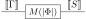

class: middle, title-slide, hide-count

## Encoding High-Level Quantum Programs as SZX-Diagrams

.author[.underline[Agustín Borgna]¹², Rafael Romero³⁴]

.date[28th June 2022]

.affiliations[
¹ CNRS LORIA, Inria-MOCQUA, Université de Lorraine

² CNRS, LMF, Université Paris-Saclay

³ CONICET, Instituto de Ciencias de la Computación, Universidad de Buenos Aires

⁴ PEDECIBA, Universidad de la República-MEC
]

???

**[Intro]**

- Work with Rafael Romero.
- Describing a compilation method from high-level quantum programs into an
  **intermediate representation** language that may be used for efficient optimization or verification.

(20 mins long)

---

# Quantum programs and circuits

.padded[
- Proto-Quipper-D is a language for describing quantum programs

  ```haskell
  bell00 : ! (Unit -> Qubit * Qubit)
  bell00 u = 
      let x = Init0 ()
          y = Init0 ()
          x' = H x
      in CNot y x'
  ```

- Compiled down to circuits of gates
  .center[
  
  ]

]

???
**[Quipper]**

- To describe introduce the compilation, we first must start with
  a description language for quantum programs.
- To this end we have chosen Proto-Quipper, a family of formalization languages for the Quipper 
  quantum programming language.
- Specifically, we are using **a fragment** of the recent Proto-Quipper-D variation, which provides linear depent types.
<!-- - By Peter Selinger, with Francisco Rios and many other people -->
<!-- - Interpreter implemented by Peng Fu -->

**[Use]**

- In this language, we can describe quantum computations
  as maps between lists of "qubit" elements that are composed from primitive operations.
- Using a syntax similar to Haskell.
- Here, for example, we have a description of a program
  that receives no input and produces a pair of qubits in a Bell state.
- We can write directly by composing primitives to initialize the qubits,
  apply a Hadamard gate, and then a CNOT.
- Ase Qubits are linear resources, the type system ensures that we never clone nor discard one.

**[Circuits]**

- To be able to run on a quantum computer,
  we must first generate a quantum circuit from this description.
- So for example, here we have the result of compiling this program.
- We can see the initialization, hadamard, and CNOT.
- It is important to note that in this version of the language we will always compile
  the complete program before executing.

---

# Dependent types for generic programming

.padded[

- Supports dependent types

  ```haskell
  cnotN : ! forall (n : Nat) -> (Vec n Qubit) * Qubit -> (Vec n Qubit) * Qubit
  cnotN (ctrls, q) = accumap (λ c q -> flip $ CNot q c) q ctrls
  ```

![:vspace .5em]

- Compilation requires instantiation (e.g. `n = 3`)
  .center[
  
  ]

]

???
**[Dependent types]**

- As I mentioned, in Proto-Quipper-D we have dependent types.
- This means that we can write programs where the types depend on the value of some parameter.

**[CNOTs]**
- For example, here we have a function that receives a target qubit and a list of `n` "control" qubits, for any non-negative `n`.
- it then applies the two-qubit CNOT operation, using as controls each one of the elements of the list.

**[Instantiation]**
- If we want to generate a circuit from this program,
  we must first instantiate the n parameter to a concrete value.
- For example we may pick `n=3`, and just then we can produce this circuit here,
- where we see that we have the list of 3 qubits and the target as inputs,
 and we do a CNOT operation using each element of the list.

**[cue ZX]**
- You may wonder then, if there is some **low-level** intermediate representation between the programs and the circuits
- which is able to encode the parametricity in a compact manner.

---

# The ZX calculus

.padded[
- Alternative representation of quantum circuits
  ![:vspace .5em]

  .center[
  
  →
  ![:hspace 1em]
  
  ![:hspace 6em]
  ]

  ![:vspace .5em]

- Only topology matters

<!-- - Corresponds to a compact closed category -->

- Formal rewrite system

- Useful for optimization, simulation, and more
]

???

**[ZX]**

- To that end we use the ZX-calculus, which is a formal graphical language
- that provides more granular representation of quantum operations than the circuits.
- **In contrast** to the circuits, we only care about the topology of the diagrams
  and not about the position of the nodes.
- As such, we may think of the diagrams as undirected open graphs with three kinds of nodes,
  and some phase labels.
- This calculus has been succesfully used in optimization and verification tecniques,
- as its formal rewrite system lets us define formally prove equivalenes between diagrams.

**[Limitations]**

- In this diagrams, edges carry one qubit of information,
- We are still restricted to only represent concrete circuits

---

# The SZX extension

.padded[
- Introduces multi-qubit wires (in bold) and gatherer/splitter nodes
  .center[
  
  ]

- Can encode parallel and iterative operations
  .center[
  `CnotN` → \\(\qquad n \mapsto\ \\) 
  ]
]

???

**[SZX]**

- The Scalable extension of the ZX calculus (SZX) lifts this restriction,
  by the edges of the graph to carry the information of multiple qubits.
- We draw this extended edges in bold and tag them with their capacity.
- The calculus also introduces a gatherer/splitter node that lets us
  merge and separate these wires.

**[Example]**

- Using this extension, we can now effectively encode the `cnotN` operation from before,
- which took a list of n control qubits and a target and applied CNOT operation over them.
- We define it as family of diagrams indexed over `n`.

- For this we use this looping construction, where we have `n` CNOT gates in parallel,
  each one applied to the corresponding elements in both of these lists.

- We take the input of the target qubit, and put it as the first element of this list,
  where it is used in a CNOT with the first control qubit.
- We then take that target qubit and loop it back, putting it now as the second element of the list.
- We repeat this until we have applied all the CNOTS, and then connect the target to the output.

**[cue Fragment]**
- We can now use this idea to formalize a compilation procedure,
- but first we must define which of the starting Proto-Quipper-D programs we are able to encode.

---

# Quipper-D calculus

.padded[
- Specification à la lambda

  .font80.center[
  \\(
    \begin{aligned}
    \text{bell00} &: \text{Unit} \multimap \qubit * \qubit \\\\
    \text{bell00} &:=
    \lambda u^{\text{Unit}}. \mathsf{CNot}\ (\mathsf{Init0}\ \star)\ (\mathsf{H} (\mathsf{Init0}\ \star))
    \end{aligned}
  \\)
  ]

- We use a simplified fragment with bounded programs (no explicit recursion)

- Additional list-manipulation operations (`accuMap`, `split`, `range`, …)

- Types split between linear states and parameters

  .center.font80[
  Types \\(A := S \;|\; P \;|\; (n : \nat) \to A[n]\\)

  States \\(S := \text{Qubit} \;|\; \text{Bit} \;|\; \text{Unit} \;|\; S_1 \otimes S_2 \;|\; S_1 \multimap S_2 \;|\; \text{Vec } (n: \nat)\ S \\)

  Parameters \\(P := \nat \;|\; \text{Vec } (n: \nat)\ \nat \\)
  ]

]

???

**[Lambda]**

- Quipper programs can be described as lambda terms.
  For example, here we have the bell program from before.
- We defined a simplified fragment of it with only the relevant operations,
- but more importantly, we disallow explicit recursion
  since the SZX diagrams cannot represent potentially non-terminating operations.
- In it's place, we include a number of list-manipulation primitives such as folding and mapping.

**[Terms]**

- Furthermore, the simplified types are divided between states
  (lists and tuples of qubits) and parameters (which are only natural numbers).
- In this system, a quantum program is a family of quantum state operations,
  potentially indexed by any number of parameters.
- Elements with a state type must be used **linearly**, as we want no discarding nor cloning.

---

# Lambda terms as SZX-diagrams

.padded[
- Translate type judgements to families of diagrams
  .font90.center[

  \\(\Gamma, \Phi \vdash M : S \quad \\)
  →
  \\(|\Phi| \mapsto\\)
  
  ]

- State types translate to number of qubits

  .center.font90[
  \\(\trans{\mathsf{Qubit}} = 1\\)

  \\(\trans{\mathsf{Vec}\ n\ A} = \trans{A} \times n \\)

  \\(\trans{A \multimap B} = \trans{A \otimes B} = \trans{A} + \trans{B}\\)
  ]

- Parameters create generic diagrams
  .font90.center[

  \\(\Gamma, \Phi \vdash M : (n:\nat) \to S[n] \quad \\)
  →
  \\(\quad |\Phi|, n \mapsto\\)
  
  ]

]

???

**[Translation]**

- Now, having both sides of the equation, we can define the translation procedure
  from the Proto-Quipper-D fragment into SZX diagrams.
- We define it over the type judgements,
  were we have a term given some type (an state type in this case),
- under a state context and a parameter context.
- From it we produce a family of diagrams indexed by the parameters
- and describing a diagram with the state context as input and the type as output.

**[Types]**

- Since we want the wires to carry state values, we must describe a translation
  from the state types into a number of qubits.
- So for a list of qubits we take the length and from a product the sum.
- As diagrams are compact closed, a function between qubit states to having a product,
  so we also translate it as a sum.

**[Parameters]**
- When we translate a a dependent function,
  we take those parameters and use them as indexes of the family.
- The diagram may then have mathematical expressions in the labels
  that will be evaluated into numbers once we specialize it.
- It's important to note, that parameters **cannot change the structure**
  of the diagrams, only the labels.

<!--
**[Notation]**

- I will ignore the translation brackets most of the time
-->

---

# Translating λs

.padded[
- State operations are represented diagrammatically

![:vspace 1em]

.font70.center[

\\(
  \begin{prooftree}
    \AxiomC{$\Gamma, x:{S_1},\Phi \vdash M:{S_2}$}
  \RightLabel{ $\multimap_i$}
  \UnaryInfC{$\Gamma, \Phi \vdash \mathbf{\lambda x^{S_1} . M} : {S_2}$}
  \end{prooftree}
  \quad
\\)
→
\\(\quad |\Phi| \mapsto \\)


![:vspace 1em]

\\(
  \begin{prooftree}
    \AxiomC{$\Gamma,\Phi_1 \vdash M:{S_1} \multimap {S_2}$}
    \AxiomC{$\Delta,\Phi_2 \vdash N:{S_1}$}
  \RightLabel{ $\multimap_e$}
  \BinaryInfC{$\Gamma, \Delta, \Phi_1, \Phi_2 \vdash \mathbf{M\ N} : {S_2}$}
  \end{prooftree}
  \quad
\\)
→
\\(\quad |\Phi_1|, |\Phi_2| \mapsto \\)


]

]

???

**[Lambda terms]**

- Translating a lambda term for states is simply taking the
  bound variable from the context of the internal term,
- and connecting it back into the output type.
- An application is then splitting that function type and connecting
  the input to the input term and the output to the output of the diagram.

---

# Parameter-dependent translations


.padded[

- Instantiate families with lists of parameters

.font80.center[

![:vspace .5em]

\\(
  \begin{prooftree}
    \AxiomC{$n:\nat$}
    \AxiomC{$\Phi\vdash V: \text{Vec } n\ \nat$}
    \AxiomC{$k:\nat, \Phi, \Gamma\vdash M : A$}
  \RightLabel{ for}
  \TrinaryInfC{$\Phi, \Gamma^n \vdash \text{for } k\text{ in }V %
    \text{ do }M : \text{Vec }n\ A$
  }
  \end{prooftree}
  \quad
\\)
→
\\(\quad |\Phi| \mapsto \\)


]

![:vspace 1em]

- Parameter-dependent branching

.font80.center[

\\(
  \begin{prooftree}
    \AxiomC{$\Phi \vdash L:\nat$}
    \AxiomC{$\Phi,\Gamma\vdash M:A$}
    \AxiomC{$\Phi,\Gamma\vdash N:A$}
  \RightLabel{ $\to_i$}
  \TrinaryInfC{$\Phi, \Gamma \vdash \ifz{L}{M}{N} : A$}
  \end{prooftree}
  \quad
\\)
→
\\(\quad |\Phi| \mapsto \\)


![:vspace .5em]

.font80.align-right[

  with \\(l = \eval{L}(|\Phi|)\\)

]

]

]

???

**[Parameter controlled flow]**

- The fragment has two terms that let parameters control the flow of the program.

- First we have the for construction, which takes a list of integers 

---

# Example: Quantum Fourier transform for N qubits

.hpadded[

- Encoded as a lambda term
  
  .font70[
  
  \\(
  \definecolor{grey}{RGB}{200,200,200}
  \begin{aligned}
    \text{qft} &: (n:\nat) \to \vec{\ \qubit}{n}\multimap\vec{\qubit}{n} \\\\
    \cgrey{\text{qft}} & \cgrey{:= \lambda' n^\nat.\lambda qs^{\vec{\qubit}{n}}.
        \Qcompose} \\\\
        & \cgrey{(\Qfor{k}{\text{reverse\_vec } (0..n)}
        {\lambda qs'^{\vec{\qubit}{n}}.\text{apply\_crot } n\ k\ qs'})\ qs}
  \end{aligned}
  \\)
  
  \\(
  \begin{aligned}
    \text{apply\_crot}&: (n:\nat) \to (k:\nat) \to \vec{\qubit}{n} \multimap \vec{\qubit}{n} \\\\
    \cgrey{\text{apply\_crot}}& \cgrey{:= \lambda' n^\nat.\ \lambda' k^\nat.\ \lambda qs^{\vec{\qubit}{n}}.
    \ifz{n-k}{qs}{}}\\\\
    & \cgrey{\Qlet{h^{\vec{\qubit}{k}}\otimes qs'^{\vec{\qubit}{n-k}}}
    {\Qsplit\ k\ (n-k)\ qs}{}}\\\\
    & \cgrey{\Qlet{q^\qubit \otimes cs^{\vec{\qubit}{n-k-1}}}
    {\text{chop } qs'}{}}\\\\
    & \cgrey{\Qlet{fs^{\vec{(\qubit\otimes\qubit\multimap\qubit\otimes\qubit)}{(n-k-1)}}}
    {\Qfor{m^\nat}{2..(n-k+1)}{\text{crot }m}}{}}\\\\
    & \cgrey{\Qlet{cs'^{\vec{\qubit}{n-k-1}}\otimes q'} 
    {\Qaccumap\ fs\ (H\ q)\ cs}{}}\\\\
    & \cgrey{\text{concat } h\ (q':: cs')}
  \end{aligned}
  \\)
  
  \\(
  \begin{aligned}
    \text{crot}&: (n:\nat)\to (\qubit\otimes\qubit)\multimap (\qubit\otimes\qubit)\\\\
    \cgrey{\text{crot}}& \cgrey{:= \lambda' n^{\nat}.\lambda qs^{\qubit \otimes \qubit}.\ \Qlet{c^\qubit \otimes q^\qubit}{qs}{flip\ (R\ n\ q\ c)}}
  \end{aligned}
  \\)
  
  ]

- Compiled quantum circuit contains \\(\\mathcal{O}(n^2)\\) gates

]

???

**[Example]**

- Let's finish with a concrete example of a complex algorithm
- The exists a quantum version of the Fourier Transform for lists of qubits
- (do not look to deeply into this definition)
- Here we have shown that it can be encode it in the fragment of Proto-Quipper-D
- Normally a compilation into a quantum circuit requires a quadratic number of gates
- We can do a constant size encoding

- Let's go by parts

---

# Example: QFT translation

.padded[

- crot:  \\(n \mapsto\\) 

- apply_crot:  \\(n,k \mapsto\\) 

- qft:  \\(n \mapsto\\) 

]

---
name: last
class: inverse, noheader


.center.bold[
  Thanks!
]

---

# Extra: Translating the 'accumap' primitive


.padded.font80.center[

\\(
  \vdash \mathtt{accuMap}:
  (n:\nat) \to \text{Vec } A\ n
  \multimap \text{Vec } (A \multimap C \multimap B \otimes C)\ n
  \multimap C \multimap \text{Vec } B\ n \otimes C
  \quad
\\)
→


\\(n \mapsto \\)


]

---

# Example: QFT translation (1)

.padded[

\\(
\begin{aligned}
  \text{crot}&: (n:\nat)\to (\qubit\otimes\qubit)\multimap (\qubit\otimes\qubit)\\\\
\end{aligned}
\\)


.center[
  \\(n \mapsto \\)
  
]

]

???

**[C-Rot]**

- First, the crot term takes a pair of qubits a rotation gate over them
- This is parametrized with an int for the rotation angle
- We have a straightforward translation of this into SZX
- Splitting the pair, applying the rotation, and bundling them again

---

# Example: QFT translation (2)

.padded[

\\(
\begin{aligned}
  \text{apply\_crot}&: (n:\nat) \to (k:\nat) \to \vec{\qubit}{n} \multimap \vec{\qubit}{n} \\\\
\end{aligned}
\\)


.center[
  \\(n,k \mapsto \\)
  
]

]

???

**[apply crot]**

- The apply_crot uses the previous term
- Does an operation similar to the CNOTs function we saw before on a portion of the list
- I don't show the check that n>k but it's just a bypass

---
# Example: QFT translation (3)

.padded[

\\(
\begin{aligned}
  \text{qft} &: (n:\nat) \to \vec{\ \qubit}{n}\multimap\vec{\qubit}{n} \\\\
\end{aligned}
\\)


.center[
  \\(n \mapsto \\)
  
]

]

???

**[qft]**

- Finally, qft applies the previous term n times, varying the value of k
- If we compose these translations, we obtain a compact diagram
  that represents the QFT operation over any arbitrary number of qubits
- No need for quadratic number of gates, we have a constant size encoding
- In general, linear for the size of the program and independent of the parameters

