class: middle, title-slide, hide-count

## Towards a compiler toolchain for quantum programs

.author[Agustín Borgna]

.author[Advisors: Simon Perdrix, Benoît Valiron]

.date[13th September 2023]


.author.right[
  
  
  
  
  
  
  
  
  
  
  
]

---

class: middle, title-slide, hide-count

## Part 0: Of qubits and quantum machines

???

**[Background]**
Before presenting our results, lets talk a little bit about quantum computing.

---

# Quantum computing overview

.center[

]

???

**[Model]**
Before talking about compilers we need a clear idea of the
**model of computation** we are working with.

**[Quantum processor]**
The more common architecture for quantum computers assumes that we have a
classical processor, running a classical program that generates some series of
operations to run in a quantum co-processor.

**[Results]**
These are concrete operations that modify some internal state, and may produce
classical bits as results that get sent back to the classical computer.

**[Qubits]**
What makes this quantum co-processor special is this internal state, which is
formed by the quantum equivalent of a bit, called qubit, which show some
behaviour that cannot be efficiently simulated by a classical computer.

**[Algorithmic implications]**
Today I won't talk about the inner workings and the algorithmic implications of
this quantum state, but I will focus on the ways we interact with this quantum
co-processor.

---
count: false

# Quantum computing with qubits

.center[

]

???

**[Look closer, q circuits]**
If we look a bit closer at how we define the operations that we run, we can say
that the classical program generates batches of operations described as a quantum
circuit, which then gets sent to the quantum computer.

---
# Hybrid Quantum circuits


.center.padded[
  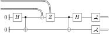
]


.padded[
- Pure quantum fragment (single wires), with classical operations (double wires)

- Interpreted as complete positive maps between Hilbert spaces
]

???

**[Left to right]**

**[Qubit wires]**

**[Gates]**
Defined by the quantum architecture. Multi-qubit gates

**[Classical control]**


---

class: middle, title-slide, hide-count

## Part 1: Optimizing hybrid circuits with the \\(\\zxGnd\\) calculus

.author[In collaboration with Simon Perdrix, Benoît Valiron]

.date[Work published at APLAS 2021 - [arXiv:2109.06071](https://arxiv.org/abs/2109.06071) ]

???

---

# The lifecycle of quantum programs

.center[

]

---
count: false

# The lifecycle of quantum programs

.center[
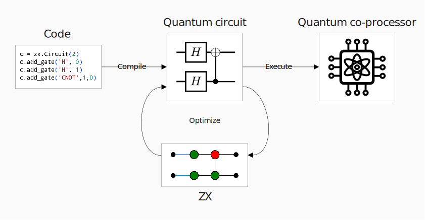
]

---
count: false

# The lifecycle of quantum programs

.center[

]

---
layout: true

# Encoding circuits in the ZX calculus

.padded[
- Unitaries can be encoded as ZX diagrams
]

.center.font120[
  
  \\(\quad \Rightarrow\\)
  <span style="width: 35%; display: inline-block">{{content}}</span>
]

.padded[
- Fine grained encoding of linear maps

- Formal set of rewriting rules

- Only topology matters
]

???

We can sidestep that problem by using a more granular representation of the
circuit based on the ZX calculus.

**[ZX]** The ZX calculus is a formal graphical language that can represent any pure
quantum circuit. Introduced by **Bob Coecke** and **Ross Duncan**.

**[Spiders]** The diagrams are simple graphs with some inputs and outputs and two kinds of nodes collored either green or red,
we call the Z-spiders and X spiders. They are also labelled with a phase.

**[HadamardW]** There is additionally a yellow constructor that represents a hadamard operation,
but for simplicity in our graph we will replace that generator with a special
kind of edge we call **Hadamard wire**.

**[Identities]**
Here the degree 2 spiders are just identities.

**[Rewrite]** The calculus comes with a complete set of rewrite rules,
between them is the spider fusion rule that lets us merge two spiders of the
same color connected by a regular edge.

**[Color]** There is also another rule that lets us change the color of a spider
by changing adding Hadamard wires to its connections.

**[Just Green]** Although this may add some extra complexity to the diagram,
it lets us work with a single color of spider, simplifying our definitions later.

**[Topology]** Another point to note is that diagrams can be freely deformed.
We only care about the topology, so the nodes can be freely moved around without
changing the interpretation of the graph.

----

- Formal Graphical Language
- Complete set of rewriting rules
- Only topology matters, deformation

---


---
count: false


---
count: false
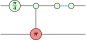

---
count: false


---
count: false
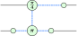

---
count: false


???

---
layout: false

# Pure ZX optimization

.padded[
- Clifford optimization for pure circuits
(Duncan et. al. arXiv:1902.03178)
]

.center.font80[
  
  
  \\(\qquad \xrightarrow{Translate}\quad\\)
  
  

  

  \\(\; \xrightarrow{Optimize}\quad\\)
  
  
  
  \\(\quad \xrightarrow{Extract}\quad\\)
  
  
]

???

**[Previous work]** Using the ZX calculus, Simon Perdrix with
**Duncan**, **Kissinger**, and **van de Wetering**
introduced an "clifford optimization" procedure for pure circuits.

**[Steps]**
The procedure starts with a pure quantum circuit,
then it does a translation into a ZX diagram in a special "graph-like" form,
then it optimizes it using some specially crafted rules in a terminating algorithm,
and finally it extracts the diagram back into a smaller circuit.

**[Hard parts]**
Emphasize hard parts. ZX is more expressive. Extraction uses graph-like, is heuristic.

**[Our modifications]**
We used this procedure as a base for our hybrid optimization.

----

---

# The \\(\zxGnd\\)-calculus

.padded[
- \\(\zxGnd\\) adds a discarding *ground generator*

.center[
  
]

- Can encode classical operations

.center.padded[
  
  \\(\qquad\quad\mapsto\qquad\\)
  
]

- New rules to discard other generators

.center.padded[
  
  \\(\qquad\quad=\qquad\\)
  
  
  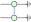
  \\(\qquad\quad=\quad\qquad\\)
  
]

]

???

**[Only pure]** Since the ZX calculus can only represent pure quantum
operations,
we use an extension called ZX ground which adds an additional information-discarding generator.

**[ground Spiders]** Since the ground generator is commonly connected to a single spider, we call
these constructions "grounded spiders".

**[rules]** ZX ground defines some extra rewrite rules, more notably the discarding rule 
that removes spiders connected to ground,
and the connection rule that lets us disconnect Hadamard wires between grounded spiders.

---
layout: true

# Quantum circuits as \\(\zxGnd\\)-diagrams


.center.font110[
  
  \\(\; \mapsto \\)
  <span style="width: 43%; display: inline-block">{{content}}</span>
]


.padded[
  - The translated diagram is *weakly graph-like*
]

???

**[translation]** Now using the ZX ground calculus we define **our** translation
from mixed circuits to into diagrams,
using a different approach than the one defined in the Clifford Optimization.

**[Parity logic]** In this translation we will also allow a reduced set of classical
parity gates consisting on NOTs and XORs.

**[IO labels]**
We also have to keep track on whether the inputs and outputs were quantum or classical wires, since we translate all to regular zx wires.

**[graph-like]** We produce diagrams in a special form called weakly graph-like,
were we only have green spiders and internal Hadamard wires.

**[strict]** We then transform these weakly graph-like diagrams
into a strict version that does not allow multiple inputs, outputs, or grounds
connected to the same spider.
This lets us detach the grounded spiders from the inputs and outputs.

----

- *Superdense coding protocol*

---


---
count: false


---
count: false
layout: false

# Quantum circuits as \\(\zxGnd\\)-diagrams


.center.font110[
  
  \\(\; \mapsto \\)
  <span style="width: 43%; display: inline-block">{{content}}
  
  </span>
]

.padded[
  - The translated diagram is *~~weakly~~* strictly *graph-like*
]

???

**[strict]** We then transform these weakly graph-like diagrams
into a strict version that does not allow multiple inputs, outputs, or grounds
connected to the same spider.
This will let us move the grounded spiders around so they interact together.

**[Clifford rules]**
The rules of the pure optimization paper continue to apply on the ground-free
parts of the diagram.

----

---

# Ground-related optimizations

.padded[
- New ground-related rules:
]

.center[

Discarding: 

\\(\ =\ \\)


Ground-Pauli pivot: 
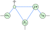
\\(\ =\ \\)


]

???

**[rules]** The first rule is the discarding rule,
which lets us delete spiders connected to a grounded spiders of degree one,

and the Ground-Pauli pivot rule deletes spiders with a phase of 0 or PI
connected to a grounded spider.

**[use same algorithm]**
We could repeat the strategy of the Clifford
optimization algorithm,
applying these rules until we cannot find any matches.

But there is a way to look for extra optimization opportunities
by looking at the ground-cut of the graph.

----

---
layout: true

# Finding optimizations on the ground-cut diagram


.hpadded[
- Find optimization opportunities by looking at the ground-cut biadjacency
  matrix
]


.center[
  {{content}}
]


.hpadded[
- Apply Gauss elimination on the matrix
]


.center[

\\(\ =\ \\)

]

???

**[partition]** The ground-cut is a partition between the grounded spiders and
non-grounded spiders.

**[matrix]**
The biadjacency matrix of this ground-cut is a binary matrix that encodes the
conectivity between the partitions.

**[row-sum]**
We define a new gFlow preserving rule that will let us apply row sums operations
over this biadjacency matrix by modifying the graph.
Therefore we are able to apply Gauss Elimination on the matrix.

**[all zeroes]**
What we end up with is a matrix that may have some rows at the bottom
were all elements are zero, that means that there is some ground spider of
degree zero which we can delete.

**[single non-zero]**
There may also be rows with only one non-zero element.
That corresponds to grounded spiders of degree 1,
where we can apply the discarding rule.

**[new matches]**
So after running Gauss elimination on the cut we may create new rule matches to
eliminate spiders from the diagram.

----

- Ground cut: **Partition** of the vertices
- Mtx encodes connectivity between sets
- Gauss elimination

---


\\(\ \mapsto\ 
  \left.
    \begin{pmatrix}
      1 & 1 \\\\
      0 & 1 \\\\
      0 & 1 \\\\
    \end{pmatrix}
  \right\\} \text{grounds}
\\)

---
count: false

\\(\ \mapsto\ 
  \left.
  \begin{pmatrix}
    1 & 0 \\\\
    0 & 1 \\\\
    0 & 1 \\\\
  \end{pmatrix}
  \right\\} \text{grounds}
\\)

---
count: false

\\(\ \mapsto\ 
  \left.
  \begin{pmatrix}
    1 & 0 \\\\
    0 & 1 \\\\
    0 & 0 \\\\
  \end{pmatrix}
  \right\\} \text{grounds}
\\)

---
layout: true

# Optimization algorithm

.columns.padded[

.column50[
Simplified algorithm:
1. Run Clifford optimizations  

2. Repeat until stable:

  1. Gauss elimination on ground-cut 

  2. Remove disconnected grounds

  3. Apply discard rule

  4. Apply ground-Pauli pivots
]

.column50.center[

{{content}}
]

]

???

**[clifford]**
We can then define the optimization algorithm by first running the original
Clifford optimization

**[gauss, disconnected]**
then we run Gauss elimination on the ground-cut,
and look if there are grounded spiders with degree 0 to delete.

**[degree 1]**
Then we apply the discard rule on ground spiders of degree 1.

**[pauli]**
And finally we apply ground-Pauli pivots where possible.

**[repeat]**
After this we repeat the this last part until we cannot find more rule matches.

**[termination]**
Since all rules remove at least one spider, this procedure terminates.


**[now to extract]**
At the of the algorithm, we obtain a smaller diagram which admits a gFlow,
but we still have to define some extraction operation to get back a circuit.

----

- Loop until no nodes to eliminate
- Terminates in polinomial time

- Complexity analysis: Loose bound - qubic on spiders

---


---
count: false


---
count: false


---
count: false
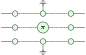

---
layout: false

# Underlying open-graph


.center.font110[
  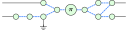
  \\(\; \mapsto \;\\)
  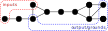
]

.padded[
- Labelled .red[input] and .blue[output/ground] nodes

- Admits a *focused gFlow* \\((G, \prec)\\) property

  - Gives a notion of order between nodes

  - Guides the extraction heuristic process

- Our optimization rules preserve the invariant
]

???

**[open-graph]** When we have a strictly graph-like diagram we can talk about
its underlying structure in the form of an open-graph; a simple graph with sets
of input and output nodes.

**[ground outputs]** We mark the ground spiders as outputs because they represent the discarding
of information into the environment.

**[lost wires]**
When we translated the circuit into a diagram we blured the separation between circuit wires, since here we can deform the graph freely.

**[gFlow]**
But we can define a property on the underlying open-graph called focused gFlow
that will give us some notion of order on the spiders
which will be necessary when we extract the diagram back into
a circuit.

**[Preserve gFlow]** It is important that we preserve the gFlow property,
so we must restrict the rewriting rules we use when optimizing.

----

- Set of *Input*, *Output* nodes
- Grounded spiders discard info
- Admits a *focused gFlow*
  - A notion imported from MBQC.
  - (Guarantees uniformly stepwise strong determinism)

---
layout: true

# Circuit extraction

.padded[
- Based on Duncan et al.'s procedure, using the gFlow invariant

- Introduces fan-in and fan-out extractions
]

.center[
  {{content}}
]

???

**[Expand Duncan et al]**
We modify the extraction algorithm from the Clifford optimization.

**[Border, sweep]**
We use the same strategy, where we define a **border** set of spiders
starting from the outputs and then sweep left, one spider at a time.

**[contribution]**
Our contribution comes with two special cases that were not present in pure
reversible circuits.

**[fan-out]**
In the first case, which we call fan-out, an unextracted spider is connected to
multiple border spiders.
We can translate this as initializing a new line and applying some Hadamards and
controlled Zs.

**[fan-in]**
The other special case is the fan-in,
where we have multiple unextracted spiders connected to a single border spider.

**[mostly ground neighbours]**
Since the diagram admits a gFlow, we know that at least n-1 of the unextracted
spiders must be grounded spiders.
We can then extract them as measuring the line and discarding the result.

**[Classical inputs]**
At the end of the extraction algorithm,
if there are any classical wires as inputs,
we use them to inizialize new qubits wires.

**[Color change]**
Afterwards we can apply the color changing rule to eliminate some Hadamards and
simplify the circuit one last time.

**[Quantum internals]**
At this point we have extracted a valid circuit, but you may note that all the
internal operations are pure quantum.

**[Example wastefull]**
For example this part here is creating a new qubit to use as control in a CNOT
and measuring it rigth after.

----

---


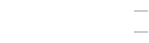

---
count: false


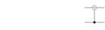

---
count: false


---
count: false


---
count: false


---
count: false


---
count: false


---
count: false


---
count: false


---
count: false


---
count: false


---
count: false


---
count: false


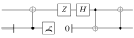

---
layout: true

# Detecting classical wires

.padded[
- We want to detect wires carrying classical data

- Developed an heuristic algorithm based on label propagation

.center[
  {{content}}
]

- Exact solution is equivalent to simulation (intractable)
]

???

**[Find classical parts]**
To solve this problem, we introduced an algorithm to detect wires carrying classical data,
allowing us to classicalize some previously quantum operations.

**[The end]**
And with this we have reached the final circuit.

----

- Classical in the Computational or in the Hadamard basis

- Expansion rules have to contemplate **color**, **label**, and **type of edges**
  for each spider.

  - Show just examples, not the full rules

---


---


---
layout: false

# Optimization results

.padded[
- We have implemented the full optimization procedure on the *pyzx* library

- Experimentally validated on randomized circuits, using the Clifford
  optimization as baseline

![:vspace .5em]

.center[

![:hspace 2em]

]
.center.font80[
![:hspace 6em]
Size reduction on Clifford+T circuits
![:hspace 12em]
Size reduction on parity classical circuits
]

]

???

Benchmarks compared with Clifford optimization.

Tested on randomized Clifford+T circuits, parity-logic circuits


---

class: middle, title-slide, hide-count

## Part 2: An IR for high-level quantum programs

.author[In collaboration with Rafael Romero (UBA/UdelaR)]

.date[Work published at QPL2022 - [arXiv:2206.09376](https://arxiv.org/abs/2206.09376) ]

???

**[Intro]**

- Work with Rafael Romero.
- Describing a compilation method from high-level quantum programs into an
  **intermediate representation** language that may be used for efficient optimization or verification.

---

# The lifecycle of quantum programs

.center[

]

---
count: false

# The lifecycle of quantum programs

.center[
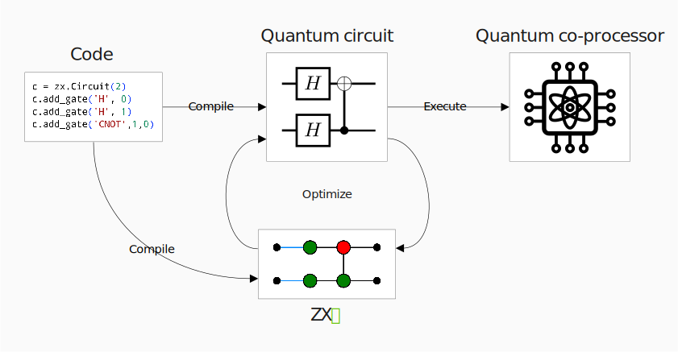
]

---
count: false

# The lifecycle of quantum programs

.center[

]

---

# The Quipper language family

.padded[
- **Quipper** is a functional quantum programming language
  developed by Peter Selinger et al.

- High-level language, with a focus on expressiveness and ease of use

- Has sprouted a family of experimental languages

- **Proto-Quiper-D**: formal variation with support for Dependent types [Fu et al. 2021]

  - Type system based on Haskell's with linear types

  - Proto-Quipper-D has a formal definition as lambda calculi with categorical
    semantics

![:vspace .5em]
  
- In this work, we use just a small fragment of Proto-Quipper-D

]

???
**[Quipper]**

- To describe introduce the compilation, we first must start with
  a description language for quantum programs.
- To this end we have chosen Proto-Quipper, a family of formalization languages for the Quipper 
  quantum programming language.
- Specifically, we are using **a fragment** of the recent Proto-Quipper-D variation, which provides linear depent types.
<!-- - By Peter Selinger, with Francisco Rios and many other people -->
<!-- - Interpreter implemented by Peng Fu -->

**[Use]**

- In this language, we can describe quantum computations
  as maps between lists of "qubit" elements that are composed from primitive operations.
- Using a syntax similar to Haskell.
- Here, for example, we have a description of a program
  that receives no input and produces a pair of qubits in a Bell state.
- We can write directly by composing primitives to initialize the qubits,
  apply a Hadamard gate, and then a CNOT.
- Ase Qubits are linear resources, the type system ensures that we never clone nor discard one.

**[Circuits]**

- To be able to run on a quantum computer,
  we must first generate a quantum circuit from this description.
- So for example, here we have the result of compiling this program.
- We can see the initialization, hadamard, and CNOT.
- It is important to note that in this version of the language we will always compile
  the complete program before executing.


---

# Quantum programs and circuits

.padded[
- Proto-Quipper-D can describe concrete quantum programs

  ```haskell
  bell00 : ! (Unit -> Qubit * Qubit)
  bell00 u = 
      let x = Init0 ()
          y = Init0 ()
          x' = H x
      in CNot y x'
  ```

![:vspace .5em]

- Compiled down to quantum circuits
  .center[
  
  ]

]

???
**[Quipper]**

- To describe introduce the compilation, we first must start with
  a description language for quantum programs.
- To this end we have chosen Proto-Quipper, a family of formalization languages for the Quipper 
  quantum programming language.
- Specifically, we are using **a fragment** of the recent Proto-Quipper-D variation, which provides linear depent types.
<!-- - By Peter Selinger, with Francisco Rios and many other people -->
<!-- - Interpreter implemented by Peng Fu -->

**[Use]**

- In this language, we can describe quantum computations
  as maps between lists of "qubit" elements that are composed from primitive operations.
- Using a syntax similar to Haskell.
- Here, for example, we have a description of a program
  that receives no input and produces a pair of qubits in a Bell state.
- We can write directly by composing primitives to initialize the qubits,
  apply a Hadamard gate, and then a CNOT.
- Ase Qubits are linear resources, the type system ensures that we never clone nor discard one.

**[Circuits]**

- To be able to run on a quantum computer,
  we must first generate a quantum circuit from this description.
- So for example, here we have the result of compiling this program.
- We can see the initialization, hadamard, and CNOT.
- It is important to note that in this version of the language we will always compile
  the complete program before executing.

---

# Dependent types for generic programming

.padded[

- Supports dependent types

  ```haskell
  cnotN : ! forall (n : Nat) -> (Vec n Qubit) * Qubit -> (Vec n Qubit) * Qubit
  cnotN (ctrls, q) = accumap (λ c q -> flip $ CNot q c) q ctrls
  ```

![:vspace .5em]

- Compilation requires instantiation (e.g. `n = 3`)
  .center[
  
  ]

]

???
**[Dependent types]**

- As I mentioned, in Proto-Quipper-D we have dependent types.
- This means that we can write programs where the types depend on the value of some parameter.

**[CNOTs]**
- For example, here we have a function that receives a target qubit and a list of `n` "control" qubits, for any non-negative `n`.
- it then applies the two-qubit CNOT operation, using as controls each one of the elements of the list.

**[Instantiation]**
- If we want to generate a circuit from this program,
  we must first instantiate the n parameter to a concrete value.
- For example we may pick `n=3`, and just then we can produce this circuit here,
- where we see that we have the list of 3 qubits and the target as inputs,
 and we do a CNOT operation using each element of the list.

**[cue ZX]**
- You may wonder then, if there is some **low-level** intermediate representation between the programs and the circuits
- which is able to encode the parametricity in a compact manner.

---

# The SZX calculus

.padded[
- The Scalable ZX extension [Carette et al. 2019] can encode multi-qubit wires

- Introduces multi-qubit wires (in bold) and gatherer/splitter nodes
  .center[
  
  \\(\quad = \quad\\)
  
  ]

- Can encode parallel and (bounded) iterative operations
  .center[
  `cnotN` →
  \\(\qquad n \mapsto\ \\) 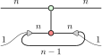
  \\(\quad\simeq\quad\\)
  \\(n \mapsto\ \\) 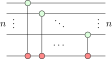
  ]

- SZX instances can be directly translated to ZX
]

???

**[SZX]**

- The Scalable extension of the ZX calculus (SZX) lifts this restriction,
  by the edges of the graph to carry the information of multiple qubits.
- We draw this extended edges in bold and tag them with their capacity.
- The calculus also introduces a gatherer/splitter node that lets us
  merge and separate these wires.

**[Example]**

- Using this extension, we can now effectively encode the `cnotN` operation from before,
- which took a list of n control qubits and a target and applied CNOT operation over them.
- We define it as family of diagrams indexed over `n`.

- For this we use this looping construction, where we have `n` CNOT gates in parallel,
  each one applied to the corresponding elements in both of these lists.

- We take the input of the target qubit, and put it as the first element of this list,
  where it is used in a CNOT with the first control qubit.
- We then take that target qubit and loop it back, putting it now as the second element of the list.
- We repeat this until we have applied all the CNOTS, and then connect the target to the output.

**[Still ZX]**

- Can always go down to ZX

**[cue Fragment]**
- We can now use this idea to formalize a compilation procedure,
- but first we must define which of the starting Proto-Quipper-D programs we are
  able to encode.

---

# Translating simple functions

.padded[

.columns[
.column[
- Quantum states as diagram output

  ```haskell
  bell00 : ! Unit -> Qubit * Qubit
  bell00 u = CNot (Init0 ()) $ H (Init0 ())
  ```
]
.column.center[
  
]
]

.columns[
.column[
- Functions are equivalent to (input \\(\otimes\\) output) products

  ```haskell
  applyU : ! (n : Nat) -> Vec n Qubit -> Vec n Qubit
  applyU n x = U n x
  ```
]

.column.center[
  \\(n \mapsto\ \\) 
]
]

.columns[
.column[
- Applications connects the corresponding wires

  ```haskell
  bell_U : ! Unit -> Vec n Qubit
  bell_U u = applyU 2 $ bell00 ()
  ```
]

.column.center[
  
]
]


]

???

**[Lying wires]**
The wires in U should come from the left, I'm ignoring some complexity here.
*Only topology matters*.

---

# Translating parametrized control flow


.padded[

.columns[
.column[
- Branching on a parameter

  ```haskell
    ifz n then X else Z : Qubit -> Qubit
  ```
]
.column.center[
  \\(n \mapsto\ \\) 
]
]

![:vspace 1em]

.columns[
.column[
- Instantiating families with lists of parameters

  ```haskell
    for k in 1..n do H : Vec n Qubit -> Vec n Qubit
  ```
]
.column.center[
  \\(n \mapsto\ \\) 
]
]

![:vspace .5em]

.columns[
.column[

]
.column.center[
  \\(\simeq \quad n \mapsto\ \\) 
]
]

]

???

**[Parameter controlled flow]**

- The fragment has two terms that let parameters control the flow of the program.

- First we have the for construction, which takes a list of integers 

---

# Example: Quantum Fourier transform for N qubits

.padded[

- Quantum analogue of the discrete Fourier Transform

  ```haskell
    qft : ! (n : Nat) -> Vec n Qubit -> Vec n Qubit
  ```

  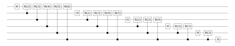
  
- The compiled quantum circuit contains \\(\\mathcal{O}(n^2)\\) gates

]

???

**[Example]**

- Let's finish with a concrete example of a complex algorithm
- The exists a quantum version of the Fourier Transform for lists of qubits
- (do not look to deeply into this definition)
- Here we have shown that it can be encode it in the fragment of Proto-Quipper-D
- Normally a compilation into a quantum circuit requires a quadratic number of gates
- We can do a constant size encoding

- Let's go by parts

---

# Example: QFT translation

.padded[

- qft:  \\(n \mapsto\ \\)  


- apply_crot:  \\(n,k \mapsto\ \\) 


- crot:  \\(n \mapsto\ \\)  

]


---
class: inverse, noheader
name: last

.center.bold.font200.nomargin[
  Conclusion
]

.center.nomargin[
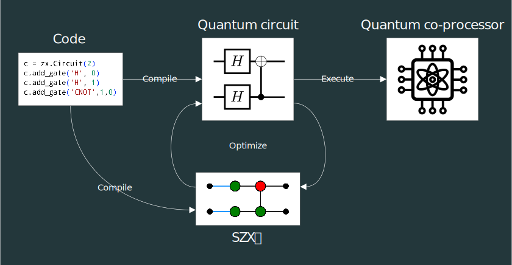
]

.hpadded[

- Optimization and classicalisation procedures presented at QPL2022 - [arXiv:2206.09376](https://arxiv.org/abs/2206.09376)

- IR compilation presented at APLAS 2021 - [arXiv:2109.06071](https://arxiv.org/abs/2109.06071)

]

???

----

--

.center.bold[
  Thanks!
]

---

# Extra: ZX rewriting rules

---

# Extra: Hybrid optimization benchmarks

---

# Extra: Translating the 'accumap' primitive


.padded.font80.center[

\\(
  \vdash \mathtt{accuMap}:
  (n:\nat) \to \text{Vec } A\ n
  \multimap \text{Vec } (A \multimap C \multimap B \otimes C)\ n
  \multimap C \multimap \text{Vec } B\ n \otimes C
  \quad
\\)
→


\\(n \mapsto \\)


]

---

# Extra: Modified \\(\lambda_D\\) definition

---

# Extra: Quantum circuit generators

.padded[
- Qubits are unitary vectors
  
  \\(\alpha \ket{0} + \beta \ket{1} \in \C^2\\)


- Unitary (invertible) operations
  
  
  \\(\qquad U \in \C^{2^n \times 2^n}\\)


- Destructive measurement
  
  \\(\ket{x}\\)
  \\(
    \begin{cases}
    \ket{0} \\\\
    \ket{1}
    \end{cases}
  \\)

]

???

**[formal definition]**

CPMs between quantum states

---
layout:false

# Clifford optimization rules

.padded[
- Clifford optimization rules
(Duncan et. al. arXiv:1902.03178):
]

.center[
Local complementation:  


Pivot:  
]

???

On the algorithm by Duncan et al. they introduced two gFlow preserving rules
that eliminate spiders with a phase multiple of PI/2, called Clifford spiders.

**[!-boxes]** The boxes in these diagrams represent any number of neighbour spiders.

**[algorithm]** They defined their optimization algorithm by repeatedly applying
these rules until reaching a stable diagram.
Since both rules delete at least one spider,
the algorithm terminates on some local minima.

**[We adapted]** We adapted these rules and introduced some new ones to work with the ZX ground calculus .

----

- On a similar formulation of graph-like diagrams in the base ZX
  - Ross Duncan, Alex Kissinger, Simon Perdrix, John van de Wetering

- Base optimizations:
  - Pivot paulis
  - Local complementation of Cliffords

- Bang-boxes
  - Already-connected spiders get disconnected

- Loop until finished

---

# A bounded Quipper-D fragment

.padded[
- Specification à la lambda

  .center[
  \\(
    \begin{aligned}
    \text{bell00} &: \text{Unit} \multimap \qubit * \qubit \\\\
    \text{bell00} &:=
    \lambda u^{\text{Unit}}. \mathsf{CNot}\ (\mathsf{Init0}\ \star)\ (\mathsf{H} (\mathsf{Init0}\ \star))
    \end{aligned}
  \\)
  ]

- We use a simplified fragment with bounded programs (no explicit recursion)

- Additional list-manipulation operations (`accuMap`, `split`, `range`, …)

- Types split between linear states and parameters

  .center[
  Types \\(A := S \;|\; P \;|\; (n : \nat) \to A[n]\\)

  States \\(S := \text{Qubit} \;|\; \text{Bit} \;|\; \text{Unit} \;|\; S_1 \otimes S_2 \;|\; S_1 \multimap S_2 \;|\; \text{Vec } (n: \nat)\ S \\)

  Parameters \\(P := \nat \;|\; \text{Vec } (n: \nat)\ \nat \\)
  ]

]

???

**[Lambda]**

- Quipper programs can be described as lambda terms.
  For example, here we have the bell program from before.
- We defined a simplified fragment of it with only the relevant operations,
- but more importantly, we disallow explicit recursion
  since the SZX diagrams cannot represent potentially non-terminating operations.
- In it's place, we include a number of list-manipulation primitives such as folding and mapping.

**[Terms]**

- Furthermore, the simplified types are divided between states
  (lists and tuples of qubits) and parameters (which are only natural numbers).
- In this system, a quantum program is a family of quantum state operations,
  potentially indexed by any number of parameters.
- Elements with a state type must be used **linearly**, as we want no discarding nor cloning.

---

# Lambda terms as SZX-diagrams

.padded[
- Translate type judgements to families of diagrams
  .center[

  \\(\Gamma, \Phi \vdash M : S \quad \\)
  →
  \\(|\Phi| \mapsto\\)
  
  ]

- State types translate to number of qubits

  .center[
  \\(\trans{\mathsf{Qubit}} = 1\\)

  \\(\trans{\mathsf{Vec}\ n\ A} = \trans{A} \times n \\)

  \\(\trans{A \multimap B} = \trans{A \otimes B} = \trans{A} + \trans{B}\\)
  ]

- Parameters create generic diagrams
  .center[

  \\(\Gamma, \Phi \vdash M : (n:\nat) \to S[n] \quad \\)
  →
  \\(\quad |\Phi|, n \mapsto\\)
  
  ]

]

???

**[Translation]**

- Now, having both sides of the equation, we can define the translation procedure
  from the Proto-Quipper-D fragment into SZX diagrams.
- We define it over the type judgements,
  were we have a term given some type (an state type in this case),
- under a state context and a parameter context.
- From it we produce a family of diagrams indexed by the parameters
- and describing a diagram with the state context as input and the type as output.

**[Types]**

- Since we want the wires to carry state values, we must describe a translation
  from the state types into a number of qubits.
- So for a list of qubits we take the length and from a product the sum.
- As diagrams are compact closed, a function between qubit states to having a product,
  so we also translate it as a sum.

**[Parameters]**
- When we translate a a dependent function,
  we take those parameters and use them as indexes of the family.
- The diagram may then have mathematical expressions in the labels
  that will be evaluated into numbers once we specialize it.
- It's important to note, that parameters **cannot change the structure**
  of the diagrams, only the labels.

<!--
**[Notation]**

- I will ignore the translation brackets most of the time
-->
