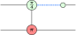
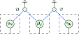
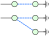
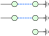
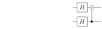
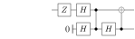

class: middle, title-slide, hide-count

## Hybrid quantum-classical circuit optimization with the ZX-calculus

.author[.underline[Agustín Borgna]¹², Simon Perdrix¹, Benoît Valiron³]

.date[23rd September 2020]

.affiliations[
¹ CNRS LORIA, Inria-MOCQUA, Université de Lorraine

² CNRS, LRI, Université Paris-Saclay

³ École CentraleSupélec, LRI, Université Paris-Saclay
]

---

# The setting

.padded[
- Mixed quantum-classical circuits expressed in the circuit model
]

.center[
  
]

---
layout: true

# ZX-diagrams

.middle.center.font120[
  
  \\(\; \Rightarrow\\)
  {{content}}
]

---

---
count: false

---
count: false

---
count: false

---
count: false

---
count: false

---
layout: true

# The \\(\zxGnd\\)-calculus

.padded[
  - \\(\zxGnd\\) adds a discarding *ground generator*
]

.center.padded[
  {{content}}
]

.center.font80[
  
  \\(\qquad=\qquad\\)
  
  
  
  \\(\qquad=\qquad\\)
  
]

---

---
count: false

---
layout: true

# Quantum circuits as \\(\zxGnd\\)-diagrams

.center.font110[
  
  \\(\; \mapsto \\)
  {{content}}
]

.padded[
  - The translated diagram is *weakly graph-like*
]

---

---
count: false

---
count: false
layout: false

# Quantum circuits as \\(\zxGnd\\)-diagrams

.center.font110[
  
  \\(\; \mapsto \\)
  {{content}}
  
  
]

.padded[
  - The translated diagram is *~~weakly~~* **strictly** *graph-like*
]

---
layout: true

# Underlying open-graph

.center.font110[
  
  \\(\; \mapsto \;\\)
  {{content}}
]

.padded[
- Labeled .blue[input] and .red[output] nodes

- Admits a *focused gFlow*
]

---

---
layout:false

# ZX diagram optimization rules

.padded[
- gFlow-preserving Clifford optimization
(Duncan et. al. arXiv:1902.03178):
]

.center[
Local complementation:  

Pivot:  
]

---

# Ground-related optimizations

.center[

Discarding: 

\\(\ =\ \\)

Ground-Pauli pivot: 

\\(\ =\ \\)

]

---
layout: true

# Finding optimizations on the ground-cut diagram

.hpadded[
- Find optimization opportunities by looking at the ground-cut biadjacency
  matrix
]

.center[
  {{content}}
]

.hpadded[
- Apply Gauss elimination on the matrix
]

.center[

\\(\ =\ \\)

]

---

\\(\ \mapsto\ 
  \begin{pmatrix}
    1 & 1 \\\\
    0 & 1 \\\\
    0 & 1 \\\\
  \end{pmatrix}
\\)

---
count: false

\\(\ \mapsto\ 
  \begin{pmatrix}
    1 & 0 \\\\
    0 & 1 \\\\
    0 & 1 \\\\
  \end{pmatrix}
\\)

---
count: false

\\(\ \mapsto\ 
  \begin{pmatrix}
    1 & 0 \\\\
    0 & 1 \\\\
    0 & 0 \\\\
  \end{pmatrix}
\\)

---
layout: true

# Optimization algorithm

.columns.padded[

.column50[
Simplified algorithm:
1. Run Clifford optimizations  

2. Loop until stable:

  1. Gauss elimination on ground-cut 

  2. Remove disconnected grounds

  3. Apply discard rule

  4. Apply ground-Pauli pivots
]

.column50.center[

{{content}}
]

]

---

---
count: false

---
count: false

---
count: false

---
layout: true

# Circuit extraction

.padded[
- Based on Duncan et al.'s procedure

- Introduces fan-in and fan-out extractions
]

.center[
  {{content}}
]

---

---
count: false

---
count: false

---
count: false

---
count: false

---
count: false

---
count: false

---
count: false

---
count: false

---
count: false

---
count: false

---
count: false

---
count: false

---
layout: false

# Detecting classical wires

.padded[
- Label the spiders that can form a classical gate

- Use classical logic where possible
]

.center[

]

---

# Summary

.padded[

- Extended a pure-quantum optimization algorithm to mixed circuits using \\(\\zxGnd\\)

- Introduced new optimization rules using the discarding operator

- Defined an extraction procedure for the optimized diagrams

- Implemented and tested on the *pyzx* python library

]

---

class: inverse, center, middle, hide-count
count: false

# Thanks!
